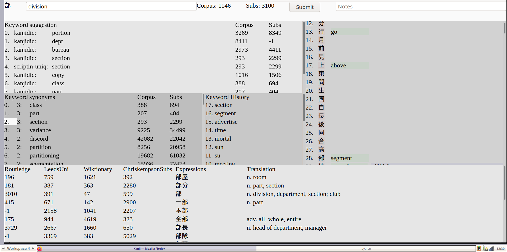

# Onyomi keywords

The files related to onyomi-keywords reside inside "onyomi-keywords/" directory.
There is also a more detailed README in that directory.

Each onyomi needs a keyword.
- it should NOT be one of 10000 most common english words.
- it should be unique for each onyomi.
- it should be written like the onyomi transcription.

Sample keywords for "な..." onyomi are below:
```
na  =  ナ  =  な  =  NApoleon
nai  =  ナイ  =  ない  =  NAIve
nan  =  ナン  =  なん  =  NANny
nei  =  ネイ  =  ねい  =  NEIghbourhood
nen  =  ネン  =  ねん  =  NEN (hunter x hunter)
netsu  =  ネツ  =  ねつ  =  NETScape
```

### Results

The onyomi keywords in plain text format are in file:
- onyomi-keywords.txt

The results are also packaged as Anki decks (.txt and .apkg)


### Resources

Sources used to decide the most appropriate ONYOMI keywords are in "resources/" directory:
- cmudict.dict contains English phonetical transcriptions (http://www.speech.cs.cmu.edu/cgi-bin/cmudict)
- english-long-frequency.txt contains English words ordered by frequency of use, taken from subtitles (https://github.com/nachocab/words-by-frequency):
- google-english-corpus.txt contains 1/3 of a million words from google english corpus ordered by frequency of use (https://norvig.com/ngrams/count_1w.txt) 
- kanjidic2.xml is a kanji dictionary with frequency counts and all onyomi for each kanji (http://www.edrdg.org/wiki/index.php/KANJIDIC_Project)


# Kanji keywords

The files related to kanji-keywords reside inside "kanji-keywords/" directory.
There is also a more detailed README in that directory.

Each kanji needs a keyword.
- it should NOT be one of 10000 most common english words.
- it should NOT be one of the onyomi keywords.
- it should be unique for each kanji.
- it should reflect meaning of the kanji.

Most common english words can be taken from 1/3 million of google english corpus (https://norvig.com/ngrams/count_1w.txt)

### Previous works:
- unique kanji keywords by scriptin on github (https://github.com/scriptin/kanji-keys)
- kanjidic2.xml has keywords for each kanji, but they might not be unique.

### Results

A web tool (backend in Python, frontend in Elm) to decide on the most fitting kanji keyword. To run the tool (needs python 3.9 due to type annotations):
```
cd kanji-keywords/backend
python main.py
```
And navigate to http://localhost:9000 in a browser, you should see the bellow screenshot:




The tool works with the sqlite database file "kanji-keywords/kanji-keywords.db".
It has a single table "kanjikeywords" to contain the results of using the tool.
The table has three columns: kanji, keyword, additional text notes


### Useful resources

Resources to compile a list of 1700 most commonly seen kanji:
- frequency-kanjidict2-freq.json extract from kanjidic2.xml according to "freq" xml tag
- frequency-kanjidict2-jlpt.json extract from kanjidic2.xml according to "jlpt" xml tag
- frequency-kanjidict2-joyo.json extract from kanjidic2.xml according to "grade" xml tag
- frequency-nozaki-lab.json slightly old kanji frequency list from (http://nozaki-lab.ics.aichi-edu.ac.jp/nozaki/asahi/kanji.html or InternetArchive: http://web.archive.org/web/20080212134350/http://nozaki-lab.ics.aichi-edu.ac.jp/nozaki/asahi/kanji.html)
- frequency-scriptin-news.json compiled by scriptin from news articles (https://github.com/scriptin/kanji-frequency)
- frequency-scriptin-twitter.json compiled by scriptin from japanese twitter posts (https://github.com/scriptin/kanji-frequency)

Japanese expressions ordered by frequency (to find common expressions with a particular kanji):
- japanese-wordfreq-routledge.json excellent resource with 5000 most common japanese lemmas and their translations from routledge (https://www.amazon.com/Frequency-Dictionary-Japanese-Routledge-Dictionaries/dp/0415610133)
- japanese-wordfreq-chriskempson-subs.json huge list of frequency count from subtitles for shows/anime (https://github.com/chriskempson/japanese-subtitles-word-frequency-list)
- japanese-wordfreq-leeds-uni.json huge list of processed lemmas by the University of Leeds (http://corpus.leeds.ac.uk/list.html)
- japanese-wordfreq-wiktionary.json 10000 most common japanese phrases from dump of Japanese Wikipedia (https://en.wiktionary.org/wiki/Wiktionary:Frequency_lists/Japanese)
- japanese-wordfreq-gfahl-go-news.xml resource was not used as I am too lazy, frequency from news about Go board game (https://github.com/gfahl/japanese-word-frequency)
- japanese-wordfreq-manythings.json resource was not used as its very similar to leeds-uni corpus (https://www.manythings.org/japanese/words/)

English words ordered by frequency (to find less common words):
- english-from-subtitles-by-freq.txt contains English words ordered by frequency of use, taken from subtitles (https://github.com/nachocab/words-by-frequency)
- english-from-gogle-corpus-by-freq.txt contains 1/3 of a million words from google english corpus ordered by frequency of use (https://norvig.com/ngrams/count_1w.txt)

English thesaurus to find synonyms to keywords:
- english-thesaurus-moby-mthesaur.txt giant thesaurus with free license (https://github.com/words/moby)
- english-thesaurus-openoffice.txt the MyThes-1 thesaurus used in OpenOffice 1.x and 2.x (https://wiki.openoffice.org/wiki/Dictionaries or https://www.openoffice.org/lingucomponent/thesaurus.html)
- english-thesaurus-wordnet.jsonl from the WordNet project (https://wordnet.princeton.edu/download)

Existing lists of kanji keywords, they are used as suggestions for keywords:
- keywords-kanjidic2-meanings.json list of kanji and possible meaning extracted from kanjidic2.xml by a custom script for this project.
- keywords-scriptin-kanji-keys.json list of unique (!) kanji keywords assigned by scriptin (https://github.com/scriptin/kanji-keys)

Other:
- kanji-by-freq.json list of 1700 most common kanji created for this project ordered by frequency.
- english-onyomi-keywords.txt contains results of onyomi-keywords project (these words can not be used as kanji keywords) (https://github.com/temach/jplang/blob/master/onyomi-keywords/onyomi-keywords.txt)
- kanjidic2.xml is a kanji dictionary with frequency counts and all onyomi for each kanji (http://www.edrdg.org/wiki/index.php/KANJIDIC_Project)

To find names for kanji that are just made up junk consider using a drawing-to-keyword mapping software:
- Draw and get accociated words: https://github.com/engelsjk/web-demo-quickdraw-visualizer
- Using QuickDraw and AutoDraw API together: https://github.com/engelsjk/python-test-googledraw-api
- Angular app that words against google quick draw API: https://github.com/Jdruwe/drawing-recognition/blob/1d7f57a5ca5fa63b4f53ed50bae03c289ffb563a/src/app/guess/guess.component.ts#L42
- The dataset behind quick draw: https://github.com/googlecreativelab/quickdraw-dataset#the-raw-moderated-dataset


# Kanji breakdown

Radical is kanji with no ONYOMI and no sub-kanji.
Regarding the breakdown it dows not matter if the element is a kanji, a radical or a handmade drawing.
So against common usage lets call everything just kanji.

Extremely useful:
- KanjiBreak by fasiha (https://fasiha.github.io/post/kanjibreak/)

### Useful resources

Previous works on kanji breakdown:
- List-of-200-radicals-used-in-Hanyu-Da-Cidian.pdf breakdown for chinese characters
- kradfile-u this is like kradfile but improved breakdowns and done in unicode!


### Methodology

There can be different ways to break kanji.

To find the best breakdown:
1. Find possible breakdowns
2. For each component in a breakdown find its possible appearances (as own kanji or sub-kanji in another kanji)
3. For each appearance find how frequently this separate identity is enforced, i.e. frequency of own kanji, frequency of kanji with this redical.
3. Sum up all the frequencies.
4. The breakdown with highest frequency wins. Its members most often appear as components/kanji.

Useful links:
- components breakdown and usage: https://thekanjimap.com/index.html
- frequency evaluation: http://scriptin.github.io/kanji-frequency/
- google quick draw for character recognition: https://www.chenyuho.com/project/handwritingjs/

**Example investigation**

What is the best way to break up 勇 ? Is it (マ + 男) OR (甬 + 力)?
Maybe its best not to break it up at all, e.g. when the kanji appears much more often than its parts?


**Take the first possible breakdown (マ + 男)**

Investigate components:
- マ never appears on its own and in 甬 
- 男 appears on its own and in 虜 

Frequency evaluation:
- 甬 appears 9 times
- 男 appears 95900 times
- 虜 appears 995 times

In total components appear (9 + 95900 + 995) ~ 97000 times


**Take the second possible breakdown (甬 + 力)**

Investigate components:
- 甬 appears on its own and in 踊, 桶, 勇(current investigation), 痛, 通
- 力 appears on its own and in about 24 other kanji

Frequency evaluation:
- 甬 appears 9 times
- 踊 appears 8799 times
- 痛 appears 20230 times
- 通 appears 109080 times
- 力 appears 112027 times
- ....

In total components appear (9 + 8799 + 20230 + 109080 + 112027 + ...) ~ 240000 times


**Take third possible breakdown (no breakdown)**

Frequency evaluation:
- 勇 appears 12432 times


**Result**

Looking at frequency evaluations, the most commonly seen pattern is breakdown with (甬 + 力),
because its members get more apperances as kanji.
